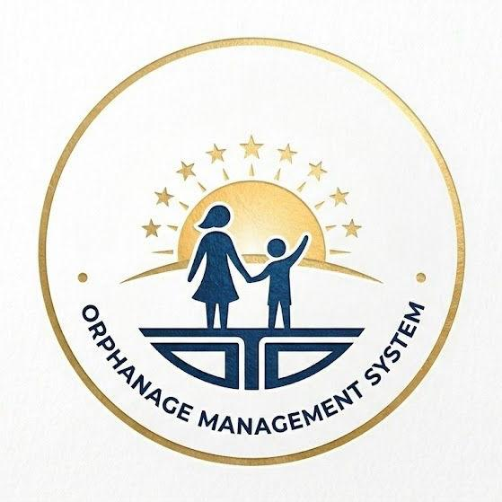

<div align="center">
  
  <h1>Orphanage Management Website | Bright Futures</h1>
  <p><b>A Comprehensive Full-Stack Solution for NGO Operations & Community Engagement</b></p>
</div>

---

## 📌 Project Overview
The **Orphanage Management Website** is a robust, enterprise-grade web application designed to bridge the gap between NGO operations and community support. Built with a focus on transparency and efficiency, the platform provides a public-facing portal for engagement and a secure, data-driven administrative dashboard to manage the daily operations of a modern orphanage.

## Core Features

### Public Engagement Portal
* **Interactive Community Hub:** A dynamic homepage showcasing active resources, latest blog updates, and upcoming events.
* **Integrated Donation Gateway:** A seamless donation interface allowing supporters to contribute to specific funds (Education, Healthcare, Nutrition) with real-time impact descriptions.
* **Volunteer Onboarding:** A dedicated application system for mentors and tutors to join the mission.
* **Fundraising Storefront:** An e-commerce section (`/shop`) featuring handmade items created by residents to support vocational training and self-sustenance.

### Secure Administrative Dashboard
* **Data-Driven Intelligence:** A centralized overview of total donations, active volunteer counts, and resource inventory levels.
* **Resident Lifecycle Management:** A comprehensive database to track resident profiles, admission history, and current status (Active, Adopted, or Transferred).
* **Resource & Inventory Control:** Real-time management of essential supplies like educational tools, medical stock, and nutrition.
* **Content CMS:** Full CRUD capabilities for administrators to publish news stories and schedule community events.

## Technical Architecture
* **Backend Framework:** Python with **Flask** for scalable server-side logic.
* **Database Management:** Relational data architecture using **SQLite** and **Flask-SQLAlchemy**.
* **Security Layer:** Implementation of **Werkzeug** password hashing and session-based authentication for administrative protection.
* **RESTful API Integration:** Custom API endpoints for asynchronous data handling and dashboard updates.
* **Environment Configuration:** Secure handling of sensitive keys using **python-dotenv**.

## The Technology Stack
* **Core:** Python 3.x
* **Web Framework:** Flask
* **Database:** SQLite3 / SQLAlchemy
* **Frontend:** HTML5, CSS3 (Custom Glassmorphism UI), JavaScript (ES6+), Jinja2
* **Communication:** Flask-Mail for automated notifications

## 🚀 Installation & Setup

1. **Clone the repository:**
   ```bash
   git clone [https://github.com/yourusername/Orphanage_Management_Website.git](https://github.com/yourusername/Orphanage_Management_Website.git)
   cd Orphanage_Management_Website

2. **Initialize the Virtual Environment:**
   ```bash
   python -m venv venv
   source venv/bin/activate  # On Windows: venv\Scripts\activate

3. **Install Dependencies:**
   ```bash
   pip install -r requirements.txt

4. **Set Up the Database:**
   ```bash
   python database.py

5. **Launch the Application:**
   ```bash
   python app.py
